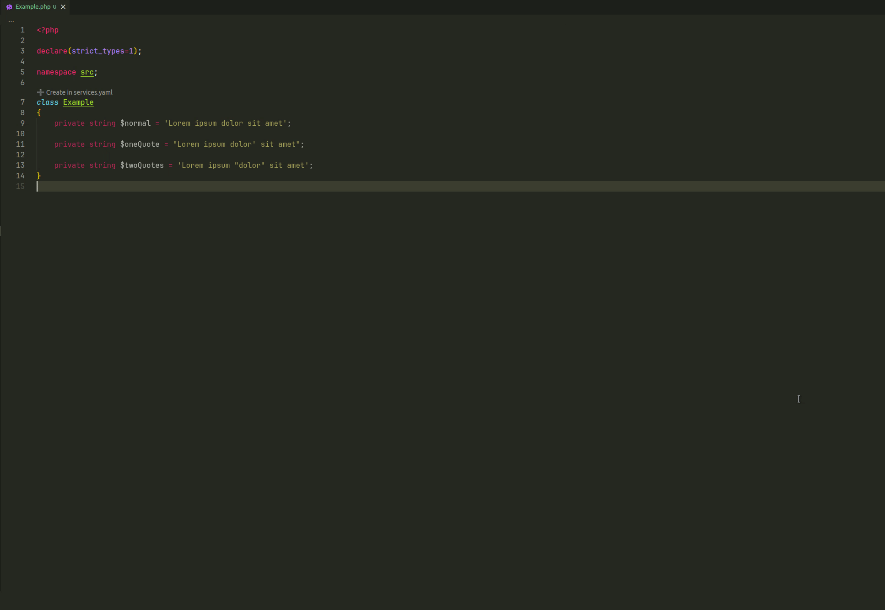
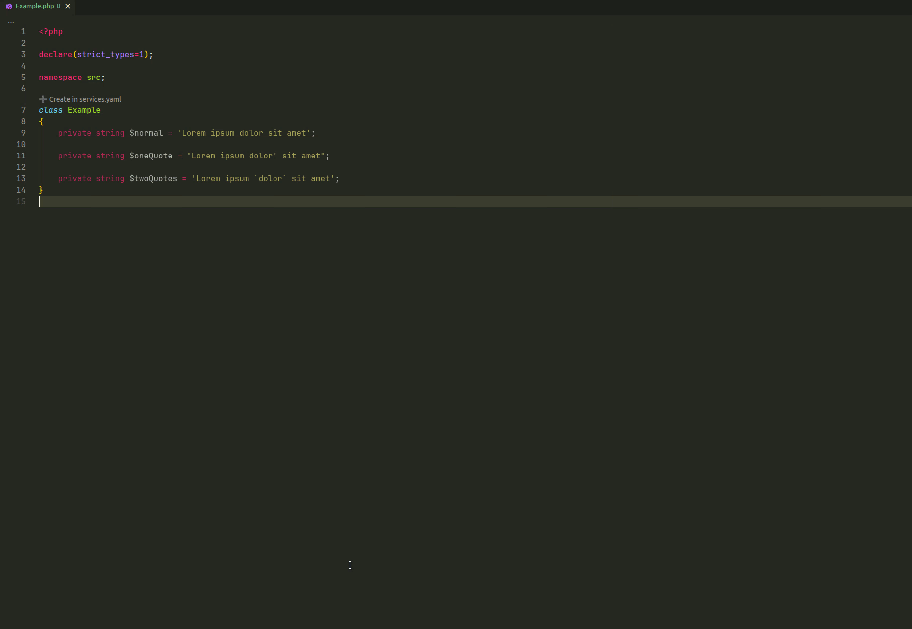
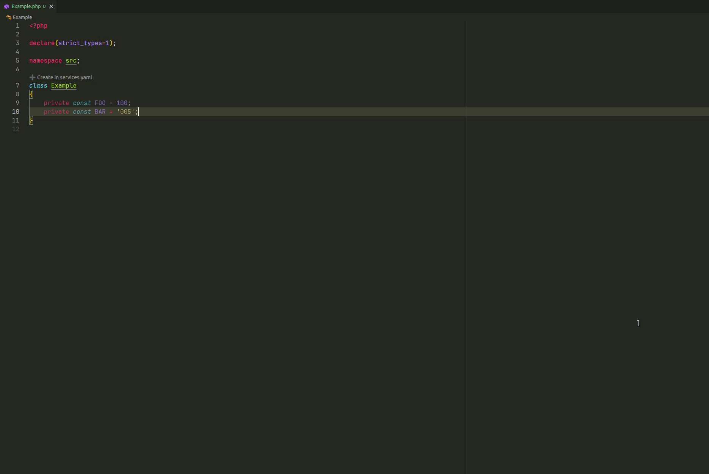
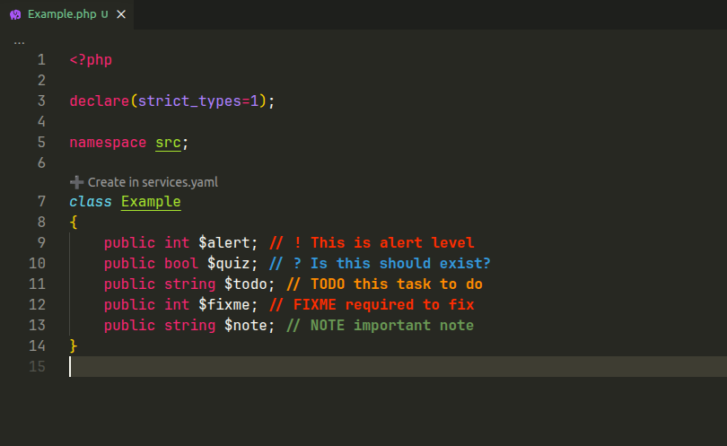
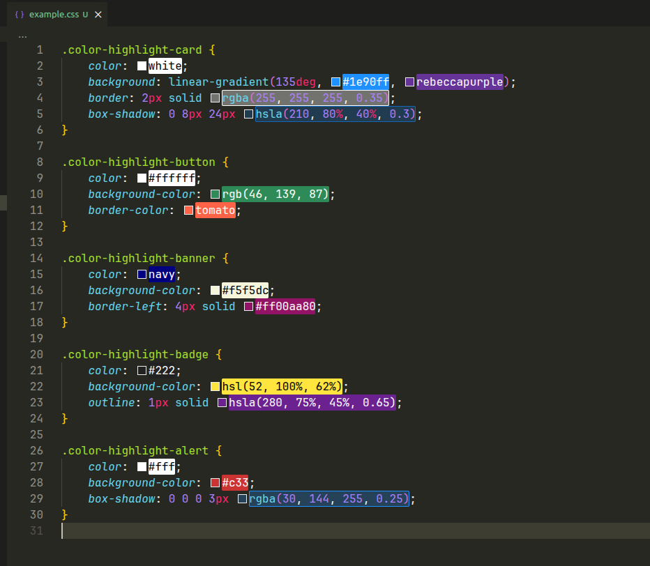

# Advanced Code Toolkit

Advanced Code Toolkit is a Visual Studio Code extension project focused on making everyday development work simpler and more convenient.

The project is intended to collect small, practical tools that reduce repetitive actions, improve the editing flow, and help developers stay focused on writing and maintaining code.

## Project Goals

- Provide lightweight utilities for common development tasks.
- Keep workflows simple, predictable, and easy to use inside Visual Studio Code.
- Avoid unnecessary complexity while improving day-to-day productivity.
- Grow gradually as useful tooling ideas become stable enough to include.

## Development Status

This project is an early-stage extension scaffold. Features and behavior may change as the toolkit takes shape.

## Features

### Toggle Quotes

Use command `Advanced code toolkit. Toggle quotes` to switch quotes around the cursor or selected text.



The quote order is controlled by `advanced-code-toolkit.toggle-quotes.quotes-order`.

Default keybindings:

- toggle quotes: `Ctrl+'`;

Default order:

```json
{
    "advanced-code-toolkit.toggle-quotes.quotes-order": ["'", "\"", "`"]
}
```

### Toggle Case

Use command `Advanced code toolkit. Toggle case` to transform the current word or selected text.



Available transformations:

- `camel`
- `constant`
- `dot`
- `kebab`
- `lower`
- `lowerFirst`
- `pascal`
- `path`
- `sentence`
- `snake`
- `swap`
- `title`
- `upper`
- `upperFirst`

Each transformation is also available as a separate command, for example `Advanced code toolkit. Toggle case 'camel'`.

### Toggle Multiline Expression

Use command `Advanced code toolkit. Toggle multiline expression` to switch the nearest supported expression between one-line and multiline formatting.

The command is currently focused on PHP, JavaScript, and TypeScript. Other languages may work in simple cases, but problems are possible because every language has its own syntax rules. Support for languages outside PHP, JavaScript, and TypeScript needs language-specific refinement.

Supported expression types:

- function and method calls;
- function and method declarations;
- arrays;
- objects.

PHP examples:

```php
$items = ['first', 'second', 'third'];
```

```php
$items = [
    'first',
    'second',
    'third',
];
```

```php
$result = buildResponse($status, $payload, $headers);
```

```php
$result = buildResponse(
    $status,
    $payload,
    $headers
);
```

JavaScript examples:

```js
const user = {id: 1, name: 'Alex', active: true};
```

```js
const user = {
    id: 1,
    name: 'Alex',
    active: true,
};
```

```js
const result = createUser(id, name, options);
```

```js
const result = createUser(
    id,
    name,
    options
);
```

Trailing commas are controlled by separate settings:

```json
{
    "advanced-code-toolkit.toggle-multiline-expression.function-trailing-comma": false,
    "advanced-code-toolkit.toggle-multiline-expression.array-trailing-comma": true,
    "advanced-code-toolkit.toggle-multiline-expression.object-trailing-comma": true
}
```

The command avoids collapsing expressions with line comments because moving them into one line can change the meaning of the code.

### Increment and Decrement Number

Use commands `Advanced code toolkit. Increment number` and `Advanced code toolkit. Decrement number` to change the natural number under the cursor.



Default keybindings:

- increment: `Ctrl+Shift+NumpadAdd`;
- decrement: `Ctrl+Shift+NumpadSubtract`.

The command checks the characters directly to the left and right of the cursor. If there is no digit next to the cursor, nothing happens. Multiple cursors are supported, and the same number is changed only once.

Examples:

```txt
0009 -> 0010
0010 -> 0009
0001 -> 0000
```

The value never goes below `0`. Leading zeros are preserved when possible.

### Comment Highlights

Comment Highlights automatically styles marked comments in the active editor. It uses the current language comment configuration, so markers are detected after the language's line comment delimiter, for example `// TODO`, `# FIXME`, or `<!-- NOTE` when the language configuration supports that syntax.



Markers are case-insensitive and the whole matching comment line is decorated. JavaScript, TypeScript, React variants, and Apex also highlight matching markers inside JSDoc-style comments. Highlighting inside regular block comments is enabled by default and can be controlled with `advanced-code-toolkit.comment-highlight-multiline`.

Both Comment Highlights and Color Highlights only scan the lines currently visible in the editor, plus a configurable padding above and below, controlled by `advanced-code-toolkit.highlight.visible-range-padding-lines` (default `500`).

The marker list and styles are controlled by `advanced-code-toolkit.comment-tags`:

```json
{
    "advanced-code-toolkit.comment-tags": [
        {
            "tag": "TODO",
            "color": "#FF8C00",
            "backgroundColor": "transparent",
            "strikethrough": false,
            "underline": false,
            "bold": true,
            "italic": false
        },
        {
            "tag": "BUG",
            "color": "#FF2D00",
            "backgroundColor": "transparent",
            "strikethrough": false,
            "underline": true,
            "bold": true,
            "italic": false
        }
    ],
    "advanced-code-toolkit.comment-highlight-plain-text": true,
    "advanced-code-toolkit.comment-highlight-multiline": true
}
```

Plain text files do not have a comment delimiter, so markers are detected at the start of a line. After changing marker definitions or styles, reload the VS Code window so decorations are recreated.

### Color Highlights

Color Highlights automatically decorates color values in the active editor.



Supported formats:

- HEX: `#fff`, `#ffffff`, `#ffffffff`;
- RGB/RGBA: `rgb(255, 0, 0)`, `rgba(255, 0, 0, 0.5)`;
- HSL/HSLA: `hsl(120, 100%, 50%)`, `hsla(120, 100%, 50%, 0.5)`;
- CSS color names: `red`, `dodgerblue`, `rebeccapurple`.

The display mode is controlled by `advanced-code-toolkit.color-highlight.mode`.

Available modes:

- `background`;
- `border`;
- `dot`.

Example configuration:

```json
{
    "advanced-code-toolkit.color-highlight.enabled": true,
    "advanced-code-toolkit.color-highlight.mode": "background",
    "advanced-code-toolkit.color-highlight.hex": true,
    "advanced-code-toolkit.color-highlight.rgb": true,
    "advanced-code-toolkit.color-highlight.hsl": true,
    "advanced-code-toolkit.color-highlight.css-names": true
}
```
